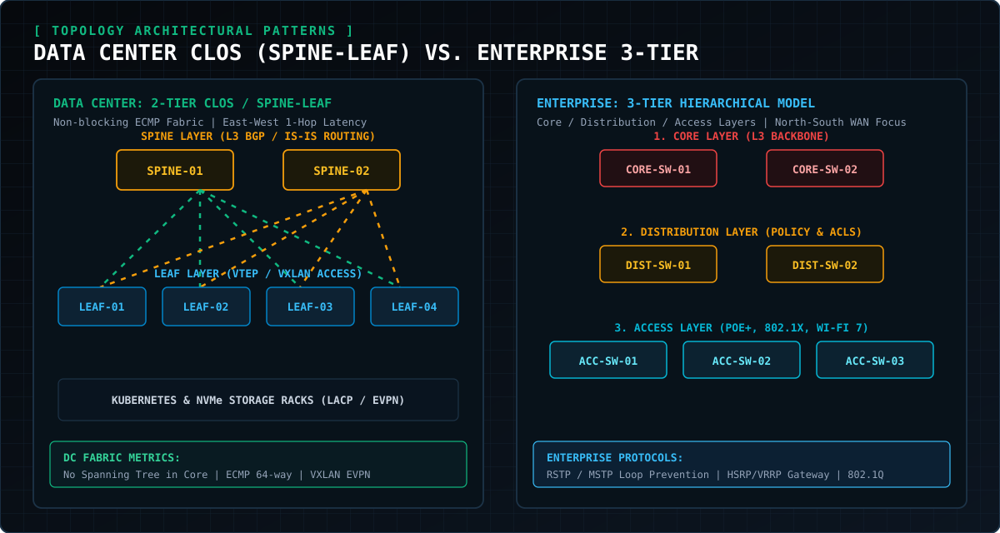
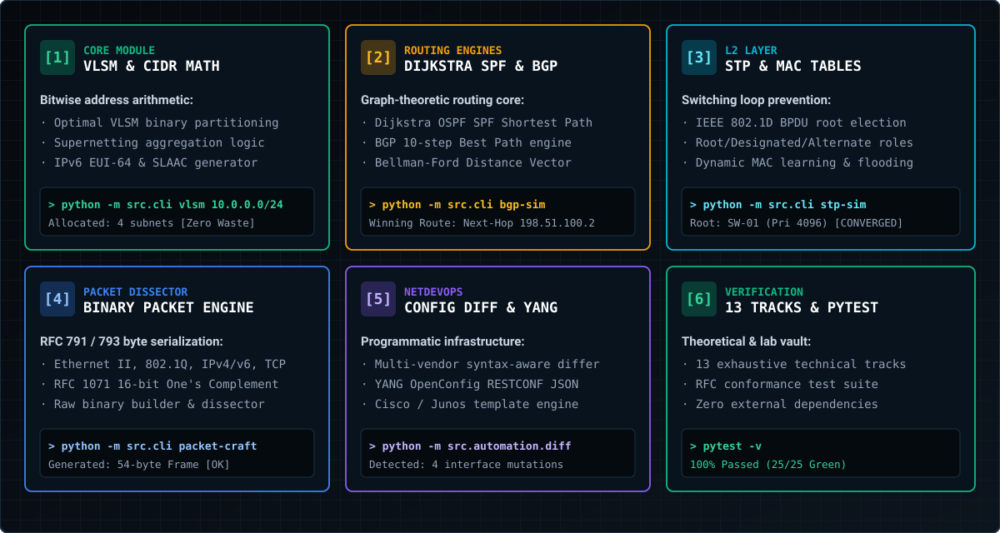
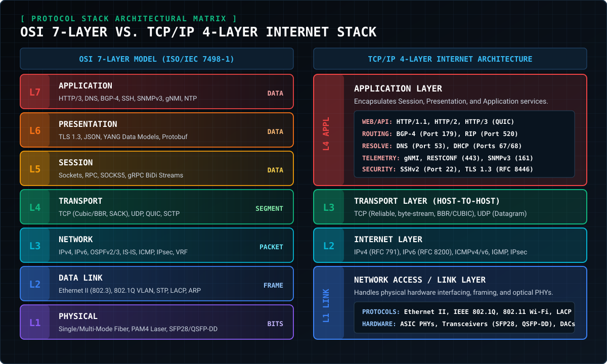
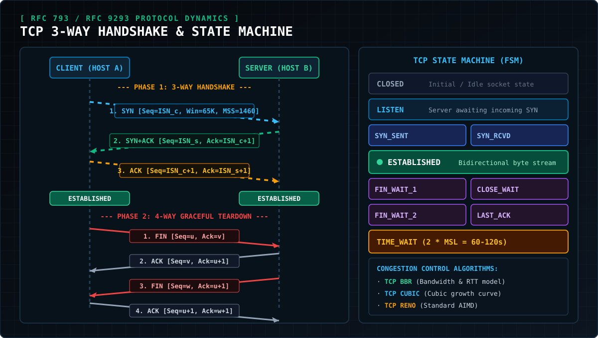
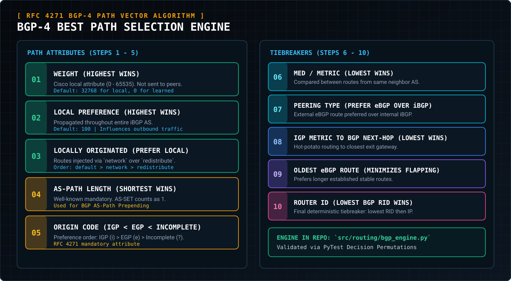

<!-- ========================================================================================= -->
<!--                  NETWORK ENGINEER COMPENDIUM & SIMULATION SUITE // HERO                   -->
<!-- ========================================================================================= -->

<div align="center">

  <!-- Responsive Animated High-Resolution SVG Banner -->
  <a href="https://github.com/Cell1991/Network-Engineer">
    
  </a>

  <br/><br/>

  <!-- Responsive Terminal Typing Stream -->
  <a href="https://github.com/Cell1991/Network-Engineer">
    
  </a>

  <br/>

  <!-- TELEMETRY STATUS BADGES (Zero Emojis) -->
  <p align="center">
    
    
    
    
    
    
  </p>

  <br/>

  <strong>The Definitive Theoretical, Algorithmic &amp; Operational Network Engineering Encyclopedia: An exhaustive, production-grade compendium spanning physical optics, IEEE 802 switching, Spanning Tree convergence, CIDR/VLSM bitwise math, OSPF SPF graphs, BGP-4 decision engines, TCP state machines, IPsec VPNs, Segment Routing, and NetDevOps programmability.</strong>

  <br/><br/>

  <!-- MOBILE-OPTIMIZED TACTICAL NAVIGATION -->
  <p align="center">
    <a href="#01-taxonomic-curriculum-matrix">
      
    </a>
    &nbsp;
    <a href="#02-system-capabilities--engineering-pillars">
      
    </a>
    &nbsp;
    <a href="#03-osi-7-layer-vs-tcpip-model">
      
    </a>
  </p>
  <p align="center">
    <a href="#04-packet-flow--protocol-dynamics">
      
    </a>
    &nbsp;
    <a href="#05-exhaustive-chapter-catalogue">
      
    </a>
    &nbsp;
    <a href="#06-repository-architecture--code-tree">
      
    </a>
  </p>
  <p align="center">
    <a href="#07-interactive-cli-suite">
      
    </a>
    &nbsp;
    <a href="#08-verification-matrix--pytest-suite">
      
    </a>
  </p>

</div>

---

<!-- ========================================================================================= -->
<!--                    01. TAXONOMIC CURRICULUM MATRIX                                        -->
<!-- ========================================================================================= -->


<div align="center">
  <br/>
  
</div>

<br/>

### Curriculum Matrix Breakdown

| Track ID | Specialized Technical Domain | Architecture Field Guide |
| :--- | :--- | :--- |
| **Track 01** | **Physical Layer &amp; Optics**<br/>• Nyquist-Shannon bounds, SMF/MMF dispersion, Link Budget<br/>• SFP28/QSFP-DD/OSFP, DOM telemetry, Cat6A/8 structured cabling | [`docs/01_physical_and_transmission.md`](./docs/01_physical_and_transmission.md) |
| **Track 02** | **Data Link &amp; Switching**<br/>• IEEE 802.3 Ethernet, 802.1Q tagging, QinQ, 802.1D/w/s STP<br/>• Dynamic MAC CAM learning, LACP bundling, VXLAN VNI overlays | [`docs/02_data_link_and_switching.md`](./docs/02_data_link_and_switching.md) |
| **Track 03** | **Network Layer &amp; IP Addressing**<br/>• RFC 791 IPv4 &amp; RFC 8200 IPv6, Binary CIDR arithmetic<br/>• Optimal VLSM partitioning, Supernetting, EUI-64 SLAAC, NAT/PAT | [`docs/03_network_layer_and_ip_addressing.md`](./docs/03_network_layer_and_ip_addressing.md) |
| **Track 04** | **Routing Protocols &amp; Graph Engines**<br/>• Dijkstra Link-State SPF, OSPFv2/v3 Area hierarchy<br/>• BGP-4 10-Step Best Path decision engine, Radix Trie LPM, PIM Multicast | [`docs/04_routing_protocols_and_architectures.md`](./docs/04_routing_protocols_and_architectures.md) |
| **Track 05** | **Transport Layer &amp; Traffic Control**<br/>• RFC 9293 TCP 11-State FSM, Sliding Window, SACK loss recovery<br/>• TCP BBR &amp; CUBIC congestion engines, QUIC 0-RTT, HTTP/3 | [`docs/05_transport_layer_and_traffic_control.md`](./docs/05_transport_layer_and_traffic_control.md) |
| **Track 06** | **Application Services &amp; Infrastructure**<br/>• DNS iterative resolution trees, DHCP 4-Way DORA &amp; Option 82 Relay<br/>• TLS 1.3 cryptographic 1-RTT handshake, SNMPv3 USM (authPriv) | [`docs/06_application_and_core_services.md`](./docs/06_application_and_core_services.md) |
| **Track 07** | **Enterprise Campus &amp; Data Center**<br/>• Cisco 3-Tier Enterprise vs. 2-Tier Clos Spine-Leaf fabrics<br/>• Non-blocking ECMP 64-way routing, FHRP (HSRP/VRRP), Wi-Fi 6/7 MLO | [`docs/07_enterprise_campus_and_datacenter.md`](./docs/07_enterprise_campus_and_datacenter.md) |
| **Track 08** | **Service Provider &amp; WAN Overlays**<br/>• MPLS label swapping, L3VPN (VRF, RD, RT), Segment Routing (SRv6)<br/>• TI-LFA 50ms Fast Reroute, SD-WAN Application-Aware Routing | [`docs/08_service_provider_and_wan.md`](./docs/08_service_provider_and_wan.md) |
| **Track 09** | **Network Security &amp; Zero Trust**<br/>• Stateful vs NGFW App-ID inspection, IPsec IKEv2 ESP tunnel mode<br/>• IEEE 802.1X EAP-TLS, NIST SP 800-207 Zero Trust, Microsegmentation | [`docs/09_network_security_and_zero_trust.md`](./docs/09_network_security_and_zero_trust.md) |
| **Track 10** | **NetDevOps Automation &amp; YANG**<br/>• NETCONF (SSH 830) / RESTCONF (HTTPS 443), OpenConfig YANG<br/>• Multi-vendor Python Netmiko/Scapy, GitOps CI/CD pre-flight pipelines | [`docs/10_network_automation_and_programmability.md`](./docs/10_network_automation_and_programmability.md) |
| **Track 11** | **Observability &amp; Troubleshooting**<br/>• Streaming telemetry (gNMI/gRPC) vs SNMP, NetFlow v9 / IPFIX<br/>• Systematic OSI L1-L7 diagnostics runbooks, Path MTU Discovery fixes | [`docs/11_telemetry_monitoring_and_troubleshooting.md`](./docs/11_telemetry_monitoring_and_troubleshooting.md) |
| **Track 12** | **Cloud Networking &amp; Interconnects**<br/>• AWS VPC / Azure VNet overlays, Transit Gateway (TGW) routing<br/>• Direct Connect / ExpressRoute redundant 100G BGP peering | [`docs/12_cloud_networking_and_hybrid_architectures.md`](./docs/12_cloud_networking_and_hybrid_architectures.md) |
| **Track 13** | **Industrial &amp; HPC Networks**<br/>• RoCEv2 Lossless Ethernet (PFC/ECN) vs InfiniBand, IEEE 1588 PTP<br/>• SCADA Modbus TCP, PROFINET RT/IRT, High-Frequency Trading | [`docs/13_industrial_and_high_performance_networking.md`](./docs/13_industrial_and_high_performance_networking.md) |

<br/>

---

<!-- ========================================================================================= -->
<!--                    02. SYSTEM CAPABILITIES & ENGINEERING PILLARS                          -->
<!-- ========================================================================================= -->


<div align="center">
  <br/>
  
</div>

<br/>

| Architectural Pillar | Engineering Guarantee &amp; Mathematical Rigor |
| :--- | :--- |
| **Mathematical Precision** | Rigorous 32-bit/128-bit bitwise arithmetic, Dijkstra graph shortest paths, Bellman-Ford distance vectors. Zero-fragmentation VLSM subnet allocator and Trie-based Longest Prefix Match (LPM) FIB engine. |
| **Bit-Level Serialization** | RFC 791, 793, 8200, and 1071 byte packing and 16-bit One's Complement internet checksum calculation. Pure binary packet builder and dissector inspecting raw Ethernet II, 802.1Q, IPv4, TCP, UDP, and ICMP frames. |
| **Zero-Dependency Core** | Clean, idiomatic, fully type-annotated Python 3.12 utilizing standard library primitives. Maximizes portability, sandbox compatibility, and execution speed without external bloat. |

<br/>

---

<!-- ========================================================================================= -->
<!--                    03. OSI 7-LAYER & TCP/IP ENCAPSULATION BLUEPRINT                       -->
<!-- ========================================================================================= -->


<div align="center">
  <br/>
  
</div>

<br/>

---

<!-- ========================================================================================= -->
<!--                    04. PACKET FLOW & PROTOCOL STATE ENGINES                               -->
<!-- ========================================================================================= -->


<div align="center">
  <br/>
  
  <br/><br/>
  
  <br/><br/>
  
</div>

<br/>

---

<!-- ========================================================================================= -->
<!--                    05. EXHAUSTIVE CURRICULUM VAULT                                        -->
<!-- ========================================================================================= -->


<br/>

### [Track 01 // Physical Layer, Transmission Media &amp; Hardware Interfaces](./docs/01_physical_and_transmission.md)
- Theoretical Foundations: Nyquist Bit Rate &amp; Shannon Channel Capacity formulas.
- Fiber Optics: Single-Mode (SMF $9\,\mu\text{m}$) vs Multi-Mode (MMF $50\,\mu\text{m}$) dispersion physics.
- Optical Link Budget: Power budget equations, insertion loss margins, and receiver sensitivity thresholds.
- Transceiver Specifications: SFP28 (25G), QSFP28 (100G), QSFP-DD (400G PAM4), and OSFP (800G).
- Structured Cabling: TIA/EIA Cat6A/Cat8 pinouts (T568A/B), DAC copper vs. AOC optical cables.
- Diagnostics: Cisco IOS-XE DOM optical telemetry and Linux `ethtool -m` SFF-8472 registers.

### [Track 02 // Data Link Layer, Ethernet Switching &amp; IEEE 802 Standards](./docs/02_data_link_and_switching.md)
- Ethernet II Framing: Preamble, SFD, Destination/Source MAC addressing (I/G, U/L bits), EtherType, and FCS CRC-32.
- 802.1Q Tagging: 4-byte header tag (TPID 0x8100, 3-bit PCP, 1-bit DEI, 12-bit VID), QinQ double tagging.
- Spanning Tree Protocols: 802.1D STP, 802.1w RSTP proposal-agreement handshake, and 802.1s MSTP instance mapping.
- Link Aggregation: IEEE 802.3ad LACP negotiation, 5-tuple hash polynomials, and port-channel failover.
- VXLAN Architecture: 24-bit VNI overlays (16M broadcast domains), VTEP tunnel encapsulation over UDP 4789.

### [Track 03 // Network Layer, IPv4/IPv6 Addressing &amp; Packet Structures](./docs/03_network_layer_and_ip_addressing.md)
- IPv4 Header (RFC 791): Bit-level analysis of IHL, DSCP/ECN, Identification, Flags (DF/MF), TTL, Protocol, and Checksum.
- Subnetting Mathematics: Complete /0 to /32 CIDR matrix, wildcard masks, usable host calculations, RFC 3021 /31 point-to-point links.
- IPv6 Architecture (RFC 8200): Fixed 40-byte base header, address scopes (Link-Local, ULA, Global Unicast), EUI-64 SLAAC derivation.
- NAT/PAT Translation: Inside Local, Inside Global, Outside Local, Outside Global session multiplexing.

### [Track 04 // Unicast &amp; Multicast Routing Architectures](./docs/04_routing_protocols_and_architectures.md)
- Routing Protocol Taxonomy: Administrative distances and metric formulation.
- OSPFv2 &amp; OSPFv3: Link-State Database (LSDB) synchronization, LSA Types 1-7, Area hierarchy, and Dijkstra SPF calculation.
- BGP-4 Best Path Selection: 10-step deterministic decision pipeline (Weight $\to$ Local-Pref $\to$ Local-Originate $\to$ AS-Path $\to$ Origin $\to$ MED $\to$ eBGP $\to$ IGP $\to$ Oldest $\to$ RID).
- Multicast Routing: IGMPv1/v2/v3, PIM Sparse-Mode ($*,G$) Shared Tree vs ($S,G$) Shortest Path Tree switchovers.

### [Track 05 // Transport Layer, TCP State Dynamics &amp; Congestion Control](./docs/05_transport_layer_and_traffic_control.md)
- TCP Segment Header (RFC 9293): Control flags (SYN, ACK, FIN, RST, PSH, URG), sequence/acknowledgement arithmetic.
- Connection Dynamics: 3-Way Handshake, 4-Way Teardown, and complete 11-state Finite State Machine (FSM).
- Flow &amp; Congestion Control: Sliding Window, Window Scaling (RFC 7323), SACK (RFC 2018), TCP Reno, TCP CUBIC, and TCP BBR (Bottleneck Bandwidth &amp; RTT).
- Modern UDP Protocols: QUIC (RFC 9000) multiplexing, 0-RTT handshakes, connection migration, and HTTP/3.

### [Track 06 // Application Layer Protocols &amp; Core Network Services](./docs/06_application_and_core_services.md)
- DNS Architecture: Root hints, TLDs, authoritative servers, recursive vs iterative resolutions, Resource Record (RR) taxonomy.
- DHCPv4 &amp; DHCPv6: 4-Way DORA handshake, Option 82 DHCP Relay Agent encapsulation, and lease lifecycles.
- Transport Layer Security: TLS 1.3 cryptographic 1-RTT handshake, Diffie-Hellman key exchange, Forward Secrecy.
- Network Management: SNMPv1/v2c vs SNMPv3 USM (authPriv with SHA-256 + AES-256).

### [Track 07 // Enterprise Campus Design, Data Center Networks &amp; Wireless](./docs/07_enterprise_campus_and_datacenter.md)
- Enterprise 3-Tier Hierarchy: Core, Distribution, and Access layers, policy boundaries, and FHRP (HSRP, VRRP, GLBP).
- Data Center Clos Fabric: 2-Tier Spine-Leaf design, non-blocking ECMP 64-way routing, predictable 2-hop latency.
- Wireless LANs: Wi-Fi 5 (802.11ac), Wi-Fi 6 (802.11ax OFDMA/BSS Coloring), and Wi-Fi 7 (802.11be MLO/$320\,\text{MHz}$).

### [Track 08 // Service Provider Architecture, MPLS, Segment Routing &amp; WAN](./docs/08_service_provider_and_wan.md)
- MPLS Fundamentals: 32-bit label structure, LFIB lookup, Penultimate Hop Popping (PHP).
- MPLS L3VPN (RFC 4364): VRF separation, 64-bit Route Distinguishers (RD), BGP Extended Community Route Targets (RT), 2-label stacks.
- Segment Routing: SR-MPLS vs SRv6, Node/Adjacency/Binding SIDs, TI-LFA sub-50ms Fast Reroute.
- SD-WAN Overlays: Centralized control plane (OMP), Application-Aware Routing (AAR) dynamic SLA steering.

### [Track 09 // Network Security, IPsec VPNs, Firewalls &amp; Zero Trust](./docs/09_network_security_and_zero_trust.md)
- Firewall Technologies: Stateless ACLs, Stateful Inspection (SPI), and Next-Generation Firewalls (NGFW App-ID/User-ID/SSL Decryption).
- IPsec Architecture: IKEv2 Phase 1 &amp; Phase 2 handshakes, ESP tunnel mode encapsulation, Diffie-Hellman groups.
- Network Access Control: IEEE 802.1X EAP-TLS authentication flow with RADIUS servers.
- Zero Trust Architecture: NIST SP 800-207 principles, microsegmentation, and continuous identity verification.

### [Track 10 // Network Automation, Programmability &amp; NetDevOps](./docs/10_network_automation_and_programmability.md)
- Model-Driven Automation: NETCONF (SSH 830) vs RESTCONF (HTTPS 443), YANG schema modeling (RFC 7950).
- Multi-Vendor Provisioning: Python script integration with OpenConfig YANG structured payloads.
- NetDevOps CI/CD: Automated GitOps deployment pipelines with pre-flight Batfish validation and pyATS testbeds.

### [Track 11 // Network Observability, Telemetry &amp; Systematic Troubleshooting](./docs/11_telemetry_monitoring_and_troubleshooting.md)
- Streaming Telemetry: Push-based gNMI/gRPC subscriptions vs pull-based SNMP polling.
- Flow Records: NetFlow v9 and IPFIX (RFC 7011) 7-tuple flow caches and exporter configurations.
- Systematic Troubleshooting: Bottom-Up, Top-Down, and Divide-and-Conquer OSI fault isolation runbooks.
- MTU &amp; MSS Issues: Path MTU Discovery (PMTUD) blackhole bugs and TCP MSS clamping solutions.

### [Track 12 // Cloud Networking &amp; Hybrid Interconnect Architectures](./docs/12_cloud_networking_and_hybrid_architectures.md)
- Cloud Virtual Networks: AWS VPC vs Azure VNet overlay architectures.
- Dedicated Interconnects: AWS Direct Connect / Azure ExpressRoute BGP peering and redundant fiber cross-connects.
- Transit Routing: Multi-VPC AWS Transit Gateway (TGW) hub-and-spoke topologies with centralized DMZ inspection.

### [Track 13 // Industrial Networking, Low-Latency &amp; High-Performance Fabrics](./docs/13_industrial_and_high_performance_networking.md)
- High-Performance Fabrics: RoCEv2 (RDMA over Converged Ethernet) vs InfiniBand, Lossless Ethernet (PFC/ECN).
- Nanosecond Time Synchronization: IEEE 1588 Precision Time Protocol (PTP) grandmaster clock calculations.
- SCADA &amp; Industrial Systems: Modbus TCP, PROFINET RT/IRT, and IEC 61850 GOOSE protocol matrices.

<br/>

---

<!-- ========================================================================================= -->
<!--                    06. REPOSITORY MONOREPO STRUCTURE & SOURCE TREE                        -->
<!-- ========================================================================================= -->


<br/>

```
Network-Engineer/
├── assets/                                      # Vector Artworks & Animated Telemetry Diagrams
│   ├── bgp-routing-engine.svg                   # BGP-4 Best Path Decision Engine Pipeline
│   ├── hero-banner.svg                          # Main Animated NOC Telemetry Banner
│   ├── network-topology-matrix.svg              # Spine-Leaf vs 3-Tier Campus Topology Matrix
│   ├── osi-vs-tcpip-model.svg                   # OSI 7-Layer vs TCP/IP 4-Layer Comparison
│   ├── packet-flow-animation.svg                # Animated Encapsulation & Transmission Path
│   ├── sec_01.svg ... sec_08.svg                # Section Divider Tactical SVG Banners
│   ├── system-capabilities-matrix.svg           # System Architecture & Capability Showcase
│   └── tcp-handshake-state.svg                  # TCP 3-Way Handshake & State Transition Diagram
├── docs/                                        # 13 Exhaustive Technical Curriculum Tracks
│   ├── 01_physical_and_transmission.md          # Optics, SFP/QSFP, Fiber Dispersion & PHYs
│   ├── 02_data_link_and_switching.md            # Ethernet II, 802.1Q, STP/RSTP/MSTP & VXLAN
│   ├── 03_network_layer_and_ip_addressing.md    # IPv4/IPv6, CIDR/VLSM, EUI-64 & NAT/PAT
│   ├── 04_routing_protocols_and_architectures.md# OSPFv2/3, IS-IS, BGP-4 & PIM Multicast
│   ├── 05_transport_layer_and_traffic_control.md# TCP FSM, SACK, CUBIC/BBR Congestion & QUIC
│   ├── 06_application_and_core_services.md      # DNS Tree, DHCP DORA, TLS 1.3 & SNMPv3
│   ├── 07_enterprise_campus_and_datacenter.md   # Clos Spine-Leaf, FHRP & Wi-Fi 6/7
│   ├── 08_service_provider_and_wan.md           # MPLS L3VPN, Segment Routing SRv6 & SD-WAN
│   ├── 09_network_security_and_zero_trust.md    # NGFW, IPsec IKEv2, 802.1X & Zero Trust
│   ├── 10_network_automation_and_programmability.md # NETCONF/RESTCONF, YANG & GitOps CI/CD
│   ├── 11_telemetry_monitoring_and_troubleshooting.md# gNMI, NetFlow, Wireshark & MTU Bugs
│   ├── 12_cloud_networking_and_hybrid_architectures.md # AWS Direct Connect, TGW & ExpressRoute
│   └── 13_industrial_and_high_performance_networking.md# RoCEv2, IEEE 1588 PTP & Modbus TCP
├── src/                                         # Production-Grade Algorithmic Source Code
│   ├── automation/                              # NetDevOps & Automation Engines
│   ├── packets/                                 # Bit-Accurate Packet Dissectors & Builders
│   ├── routing/                                 # Algorithmic Routing Engines (Dijkstra/BGP)
│   ├── subnetting/                              # Bitwise Subnetting & Address Math (VLSM)
│   ├── cli.py                                   # Unified Interactive Terminal CLI Suite
│   └── __init__.py
├── tests/                                       # 100% PyTest Verification Test Suite
├── .gitignore                                   # Monorepo Git Ignore Rules
├── LICENSE                                      # MIT Open Source License
├── pyproject.toml                               # PEP 621 Standard Package Configuration
├── pytest.ini                                   # Test Runner Configuration
└── README.md                                    # Master Encyclopedia & User Manual
```

<br/>

---

<!-- ========================================================================================= -->
<!--                    07. CLI SUITE & INTERACTIVE SIMULATION TOOLS                           -->
<!-- ========================================================================================= -->


<br/>

The repository includes a standalone, zero-dependency Python CLI tool providing instant calculations and algorithmic simulations:

### 1. IPv4 Subnet Calculator
```bash
python -m src.cli subnet 192.168.10.45/24
```
```
[+] Analyzing IPv4 Target: 192.168.10.45/24
--------------------------------------------------------------------------------
  IP Address          : 192.168.10.45 (/24)
  Subnet Mask         : 255.255.255.0
  Wildcard Mask       : 0.0.0.255
  Network Address     : 192.168.10.0
  Broadcast Address   : 192.168.10.255
  Usable Host Range   : 192.168.10.1 -> 192.168.10.254
  Total Addresses     : 256
  Usable Host Count   : 254
  Classful Category   : Class C
  RFC 1918 Private    : YES
  IP Binary           : 11000000.10101000.00001010.00101101
  Mask Binary         : 11111111.11111111.11111111.00000000
--------------------------------------------------------------------------------
```

### 2. Optimal VLSM Partitioning Planner
```bash
python -m src.cli vlsm 192.168.1.0/24 Sales:50,Dev:30,HR:10,WAN:2
```
```
[+] Executing VLSM Optimal Partition on Base Block: 192.168.1.0/24
--------------------------------------------------------------------------------
  SUBNET NAME        | REQ    | ALLOC  | CIDR               | USABLE RANGE                    
--------------------------------------------------------------------------------
  Sales              | 50     | 62     | 192.168.1.0/26     | 192.168.1.1 - 192.168.1.62      
  Dev                | 30     | 30     | 192.168.1.64/27    | 192.168.1.65 - 192.168.1.94     
  HR                 | 10     | 14     | 192.168.1.96/28    | 192.168.1.97 - 192.168.1.110    
  WAN                | 2      | 2      | 192.168.1.112/30   | 192.168.1.113 - 192.168.1.114   
--------------------------------------------------------------------------------
```

### 3. Spanning Tree Bridge Convergence Simulator
```bash
python -m src.cli stp-sim
```
```
[+] Initializing 3-Bridge Spanning Tree Protocol (IEEE 802.1D) Topology...
--------------------------------------------------------------------------------
  ELECTED ROOT BRIDGE : SW-01 (Priority 4096)
--------------------------------------------------------------------------------
  Bridge SW-01 [ROOT] (Root Path Cost = 0):
    - Port Gi0/1  : Role = DESIGNATED   | State = FORWARDING
    - Port Gi0/2  : Role = DESIGNATED   | State = FORWARDING
  Bridge SW-02 (Root Path Cost = 4):
    - Port Gi0/1  : Role = ROOT         | State = FORWARDING
    - Port Gi0/2  : Role = DESIGNATED   | State = FORWARDING
  Bridge SW-03 (Root Path Cost = 4):
    - Port Gi0/1  : Role = ALTERNATE    | State = BLOCKING
    - Port Gi0/2  : Role = ROOT         | State = FORWARDING
--------------------------------------------------------------------------------
```

### 4. BGP-4 Best Path Decision Pipeline Simulator
```bash
python -m src.cli bgp-sim
```
```
[+] Evaluating BGP-4 Best Path Selection for Prefix 198.51.100.0/24...
--------------------------------------------------------------------------------
  BGP DECISION LOG PIPELINE:
  [STEP 04] AS_PATH_LENGTH   : Prefer shortest AS-path length: 1
     Surviving   : ['198.51.100.2 (RID 2.2.2.2)']
     Eliminated  : ['203.0.113.1 (RID 1.1.1.1)']
--------------------------------------------------------------------------------
  WINNING ROUTE       : Next-Hop 198.51.100.2 via AS-PATH [65003]
--------------------------------------------------------------------------------
```

<br/>

---

<!-- ========================================================================================= -->
<!--                    08. VERIFICATION MATRIX & PYTEST SUITE                                 -->
<!-- ========================================================================================= -->


<br/>

All algorithms, binary packet dissectors, and state machines are continuously validated with a rigorous PyTest test suite:

```bash
pytest -v
```

```
============================= test session starts =============================
platform win32 -- Python 3.12.10, pytest-9.1.1, pluggy-1.6.0
rootdir: C:\Users\celle\Documents\GitHub\Network-Engineer
configfile: pytest.ini
testpaths: tests

tests/test_automation.py::test_config_differ PASSED                      [  4%]
tests/test_automation.py::test_template_rendering PASSED                 [  8%]
tests/test_automation.py::test_yang_restconf_serialization PASSED        [ 12%]
tests/test_automation.py::test_cli_execution PASSED                      [ 16%]
tests/test_packets.py::test_rfc1071_checksum PASSED                      [ 20%]
tests/test_packets.py::test_ethernet_frame_serialization_roundtrip PASSED [ 24%]
tests/test_packets.py::test_ipv4_and_tcp_serialization PASSED            [ 28%]
tests/test_packets.py::test_tcp_fsm_transitions PASSED                   [ 32%]
tests/test_packets.py::test_icmp_ping_packet PASSED                      [ 36%]
tests/test_routing.py::test_dijkstra_ospf_spf PASSED                     [ 40%]
tests/test_routing.py::test_bgp_best_path_selection PASSED               [ 44%]
tests/test_routing.py::test_radix_longest_prefix_match PASSED            [ 48%]
tests/test_subnetting.py::test_ip_to_int_and_back PASSED                 [ 52%]
tests/test_subnetting.py::test_invalid_ip_raises PASSED                  [ 56%]
tests/test_subnetting.py::test_prefix_to_mask_and_back PASSED            [ 60%]
tests/test_subnetting.py::test_subnet_info_slash_24 PASSED               [ 64%]
tests/test_subnetting.py::test_subnet_info_slash_30_and_31 PASSED        [ 68%]
tests/test_subnetting.py::test_rfc1918_classification PASSED             [ 72%]
tests/test_switching.py::test_mac_table_learning_and_forwarding PASSED   [ 76%]
tests/test_switching.py::test_stp_triangle_convergence PASSED            [ 80%]
tests/test_switching.py::test_vlan_access_and_trunk_ports PASSED         [ 84%]
tests/test_vlsm.py::test_vlsm_allocation_standard PASSED                 [ 88%]
tests/test_vlsm.py::test_vlsm_insufficient_space PASSED                  [ 92%]
tests/test_vlsm.py::test_supernet_aggregation PASSED                     [ 96%]
tests/test_vlsm.py::test_ipv6_tools PASSED                               [100%]

============================= 25 passed in 0.28s ==============================
```

<br/>

---

## Technical Standards &amp; RFC Conformance Index

- **Physical Layer**: IEEE 802.3, SFF-8472, SFF-8636, TIA/EIA-568-D
- **Data Link &amp; Switching**: IEEE 802.1D, IEEE 802.1w, IEEE 802.1s, IEEE 802.1Q, IEEE 802.3ad / 802.1AX, RFC 7348 (VXLAN)
- **Network Layer**: RFC 791 (IPv4), RFC 8200 (IPv6), RFC 4632 (CIDR), RFC 3021 (/31 Subnets), RFC 1918 (Private IP)
- **Routing Protocols**: RFC 2328 (OSPFv2), RFC 5340 (OSPFv3), RFC 4271 (BGP-4), RFC 4760 (MP-BGP), RFC 2453 (RIPv2), RFC 7761 (PIM-SM)
- **Transport Layer**: RFC 793 / RFC 9293 (TCP), RFC 768 (UDP), RFC 2018 (TCP SACK), RFC 7323 (TCP Window Scale), RFC 9000 (QUIC)
- **Application Layer**: RFC 1035 (DNS), RFC 2131 (DHCP), RFC 8446 (TLS 1.3), RFC 3411 (SNMPv3)
- **Service Provider &amp; WAN**: RFC 3031 (MPLS), RFC 4364 (BGP/MPLS L3VPN), RFC 8402 (Segment Routing)
- **Security**: RFC 4301 (IPsec), RFC 7296 (IKEv2), IEEE 802.1X, NIST SP 800-207 (Zero Trust)
- **Programmability**: RFC 6241 (NETCONF), RFC 8040 (RESTCONF), RFC 7950 (YANG)
- **Observability**: RFC 7011 (IPFIX), OpenConfig gNMI Specification

---

### Licensing

Distributed under the **MIT License**. Created by [Cell1991](https://github.com/Cell1991).
